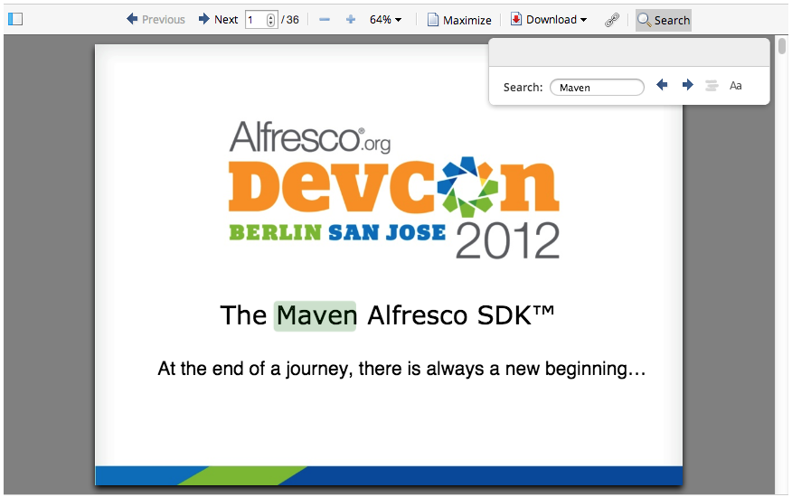
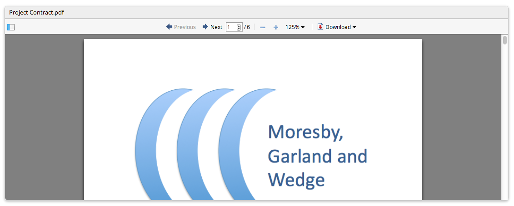

Media Viewers for Alfresco Share
================================

Authors: Will Abson (Alfresco), Peter Löfgren (Loftux AB)

This add-on project for Alfresco Share provides a number of content viewers to complement the out-of-the box set supplied with Share, plus a dashlet allowing any content item to be displayed on a site dashboard. The add-on was previously known as _Media Previews_.

Introduction
------------

Viewers can be configured into the Web Preview component of the Document Details Page. In addition, the add-on supplies a custom dashlet which can be used to display any chosen document or content item on a site dashboard.

### Custom Viewers

The following viewers are supplied in the v2.x add-on for use on Alfresco 4

#### PdfJs

PdfJs displays documents, presentations and any other file capable of being transformed to PDF in-line in the web browser using the excellent [pdf.js](http://mozilla.github.com/pdf.js/) viewer, which uses the power of HTML5 to remove Share's Flash dependency for document viewing.
  
The viewer supports a number of features not directly supported by the Flash document previewer, such as a sidebar with thumbnail, outline and search views, bookmarking of individual pages of a document, and will remember the page number and zoom level of previous documents that you have viewed.
  

### FLVPlayer and MP3Player

FLVPlayer and MP3Player display compatible audio and video files respectively, within the web-browser using the open source [FLV Player](http://flv-player.net/) and [MP3 Player](http://flash-mp3-player.net/) media players by [neolao](http://www.neolao.com/). Based on the content's MIME type, the updated component automatically chooses the appropriate previewer to use.

While similar to the Flash players provided by Share out-of-the-box, these implementations allow advanced customization of the player via configuration and if [FFmpeg](http://ffmpeg.org/) is installed, will fire up a transformation to allow viewing of non-H264/FLV video and non-MP3 audio. The user is informed when conversion is in progress and the screen automatically updates when the content can
be viewed.

#### Embed

Embed uses an in-line iFrame to embed the content itself directly inside the web page. It is suitable for use with content types that can be viewed directly within the web browser such as plain text and PDF, with the Chrome or Acrobat plugins installed. Again, this can be used to avoid the use of 
the Flash previewer for some clients.

#### Prettify

Prettify allows formatted code, mark-up and other supported text formats
to be displayed in directly in the document and uses the [google-code-prettify](https://code.google.com/p/google-code-prettify/)
project to provide an in-line browser-based view with syntax highlighting.

#### WebODF

WebODF is an EXPERIMENTAL viewer which uses the AGPL-licensed [WebODF](http://www.webodf.org/) 
project to display ODF content directly in the web browser.

WebODF cannot be distributed with the add-in itself, so in order to use it you must also
download the latest JAR file from the supporting [share-webodf project](https://github.com/wabson/webodf-share/downloads) and
install it in the same way as the main media-viewers JAR file.

### Document Viewer Dashlet

This custom dashlet allows a site administrator to pick a content item from the site which will be displayed to
all site members on the site dashboard. The dashlet will choose the correct viewer automatically and is 
able to use the out-of-the-box viewers supplied plus the custom viewers provided by this add-on or other add-ons.

### Repository Configuration

In addition to the Share component extensions the add-on supplies repository extension configuration
for defining 'thumbnailed' content in PDF, H264/FLV and MP3 formats, a full-size image thumbnail for 
video files in JPEG format, and a transformer based on FFmpeg for generating the audio and video formats.

Download
--------

For Alfresco 4.x, download the latest 2.x version of Media Viewers.

 * [Download Media Viewers add-on](http://code.google.com/p/share-extras/downloads/list?q=media-viewers)

For Alfresco 3.x, download the latest 0.x or 1.0 version of Media Preview.

 * [Download Media Previews add-on](http://code.google.com/p/share-extras/downloads/list?q=media-preview)

Installation
------------

Copy the JAR file into the `tomcat/shared/lib` folder of your Alfresco installation (create the `lib` directory if it does not exist). If you are hosting the repository and Share in different Tomcat containers then you should install it in both.

See [Configuration](#Configuration) below, for instructions on how to enable the viewers in Share.

### FFmpeg Installation (optional; only required for custom audio/video players)

The supplied Spring configuration extends the repository thumbnailing capabilities to support H264/FLV thumbnails for video content and MP3 thumbnails for audio content, both using FFmpeg, and PDF thumbnails for content such as Microsoft Word and Powerpoint files. PDF thumbnails can be generated using the default repository transformers,
but a custom transformer is supplied to enable the FFmpeg transformations.

The previews therefore do not require FFmpeg, but it is highly recommended to support the widest range of formats, and for thumbnail image generation.

To enable FFmpeg support you must

1. Install FFmpeg (with [x264](http://www.videolan.org/developers/x264.html)) on the server
   
   It is unlikely that your standard package manager will install this for you. The [FFmpeg documentation](https://ffmpeg.org/trac/ffmpeg/wiki) does however contain detailed documentation for compiling on [Ubuntu](https://ffmpeg.org/trac/ffmpeg/wiki/UbuntuCompilationGuide) and [other operating systems](https://ffmpeg.org/trac/ffmpeg/wiki/CompilationGuide) and the project also makes pre-built binaries available for [download](http://ffmpeg.org/download.html).
   
2. If the `ffmpeg` executable is not on your system's PATH (i.e. typing `ffmpeg -version` indicates that `ffmpeg` could not be found), you must edit your `alfresco-global.properties` file to define the correct location

        ffmpeg.exe=<location of ffmpeg executable>
   
   The path should not contain spaces, and if you are on Windows you should use forward slashes rather than backslashes as your directory separator, or use double-backslashes to escape them.

If you are running Alfresco and Share in the same application server then the JAR file also contains the required repository configuration, but if these are in separate containers then you will need to install it into both.

Check the `alfresco.log` file while the repository is starting up for any warnings or errors related to FFmpeg, if you have enabled it.

Building from Source
--------------------

The dashlet is packaged as a single JAR file for easy installation into Alfresco Share.

An Ant build script is provided to build a JAR file containing the custom files, which can then be installed into the `tomcat/shared/lib` folder of your Alfresco installation.

To build the JAR file, run the Ant from the base project directory.

    ant -f project.xml dist-jar

Or, for the 0.x/1.0 release

    ant dist-jar

The command should build a JAR file named `media-viewers-<version>.jar` in the `build/dist` directory within your project.

To deploy the add-on files into a local Tomcat instance for testing, you can use the `hotcopy-tomcat-jar` task. You will need to set the `tomcat.home` property in Ant.

    ant -f project.xml -Dtomcat.home=C:/Alfresco/tomcat hotcopy-tomcat-jar

After you have deployed the JAR file you will need to restart Tomcat to ensure it picks up the changes.

Configuration
-------------

No additional configuration is required for the 0.x/1.x version of the add-on in Alfresco 3, beyond the optional FFmpeg installation documented in _[Installation](#installation)_, above (required if you wish to use audio/video renditions with the FLVPlayer and MP3Player plugins).

If you are using Alfresco 4, you must enable the correct module in Share's [Module Deployment console](http://code.google.com/p/share-extras/wiki/ModuleDeployment), which can be accessed by navigating to `http://hostname:port/share/page/modules/deploy` on your Alfresco server.

The following modules will import the dependencies for the different viewers. You may enable as many as you need.

 * PdfJs Viewer
 * Embed Viewer
 * FLVPlayer Viewer
 * MP3Player Viewer
 * Prettify Viewer
 * WebODF Viewer (Experimental)

The final step to configure the exact content types which the viewer should be used for varies between Alfresco 4.0/4.1 and 4.2, so please follow the correct instructions for your Alfresco version.

### Alfresco 4.2

If you are using Media Viewers 2.5 or greater on Alfresco 4.2, then you can use the additional configuration modules, e.g. **PdfJs Configuration**, to automatically enable the viewers in the Document Details page and the dashlet. No overriding of `web-preview.get.config.xml` is required.

### Alfresco 4.0/4.1

If installing the add-on in Alfresco 4.0/4.1, you must configure the `web-preview.get` component to use the particular viewers that you wish to enable. To do this, you must 

1. Copy the file `WEB-INF/classes/alfresco/site-webscripts/org/alfresco/components/preview/web-preview.get.config.xml` from the exploded Alfresco webapp into the directory `alfresco/web-extension/site-webscripts/org/alfresco/components/preview` under your `tomcat/shared/classes`. You will need to create the new directories if you have not done this previously.

2. Modify that file to add in the new viewers as needed, or replace the content with the [suggested sample configuration](https://gist.github.com/wabson/5057107)

An in-depth discussion of the redesigned `web-preview` component in Alfresco 4 is provided on 
[Will's blog](http://blogs.alfresco.com/wp/wabson/2012/04/11/share-document-previews-in-alfresco-4/),
where the configuration mechanism is explained. 

Usage
-----

Upload a supported file type to Alfresco Share and navigate to the Document Details page to see the preview.

To use the Document Viewer dashlet, navigate to a site dashboard. Then, click the _Customize Dashboard_ button to edit the contents of the dashboard and drag the dashlet into one of the columns from the list of dashlets.

Troubleshooting
---------------

###Web Previews

The most common problem that you may see when using the viewers is that the text _Preparing Previewer..._ is shown on the screen. This is usually accompanied by an error in the browser JavaScript console indicating that the plugin instance could not be created.

If you see this on your system, check that the add-on is installed correctly and that you have enabled the relevant viewers in the Module Deployment console.

 * If your content does not load using the viewers, check that you have enabled the viewer and configuration modules in Share's Module Deployment console, and (for Alfresco 4.0/4.1) that you have configured your `web-preview.config.xml` as documented above
 * If PDF content loads using the PdfJs or Embed viewers but other document types do not (e.g. Word, PowerPoint), check that you have added the JAR file to the repository or at least added the <a href="config/alfresco/extension/org_sharextras_pdfviewer-context.xml">repository Spring configuration</a> in your `<TOMAT_HOME>/shared/classes/alfresco/web-extension` folder.

###FFmpeg

If you have problems with audio and video previews or thumbnails not working, first check your `alfresco.log` for any errors being thrown at startup, relating to FFmpeg. 
If no errors are shown, you can force the transformers to give you a little more information by adding the 
following lines to the file `webapps/alfresco/WEB-INF/classes/log4j.properties`.

    log4j.logger.org.alfresco.util.exec.RuntimeExec=debug
    log4j.logger.org.alfresco.repo.content.transform=debug
    log4j.logger.org.alfresco.repo.thumbnail=debug

If no problems are obvious and you _still_ find that thumbnails do not get generated or the player does not render, 
you can make a direct request for the specific renditions to help diagnose the problem. In the URLs below you 
will need to replace the `{nodeId}` token with the GUID of the problematic file (which you can grab from the end of 
the Document Details page URL), and substitute in the hostname of your server in place of `{hostname}`.

 * For thumbnail problems, hit [http://{hostname}/share/proxy/alfresco/api/node/workspace/SpacesStore/{nodeId}/content/thumbnails/doclib?c=force](http://{hostname}/share/proxy/alfresco/api/node/workspace/SpacesStore/{nodeId}/content/thumbnails/doclib?c=force)
 * For player problems, hit [http://{hostname}/share/proxy/alfresco/api/node/workspace/SpacesStore/{nodeId}/content/thumbnails/h264preview?c=force](http://{hostname}/share/proxy/alfresco/api/node/workspace/SpacesStore/{nodeId}/content/thumbnails/h264preview?c=force)

This should force the thumbnails to be generated syncronously, and a stack trace will be visible in the page response or in `alfresco.log`.

Known Issues
------------

* Internet Explorer is only supported in version 10 and greater due to performance problems in that browser. The Embed viewer can be used instead, otherwise rendering will fall back to the out-of-the-box Flash viewer.

* In versions 3.3, 3.4.a, 3.4.b and 3.4.c, the video player only supports previews of MP4 and FLV content, due to 
  a bug whereby the thumbnail service [cannot produce renditions using a RuntimeExec transformer](https://issues.alfresco.com/jira/browse/ALF-4214). 
  The workaround for this is to apply the fix in the JIRA issue to patch your 
  own `alfresco-repository.jar`. This is fixed in version 3.4.d.

* Prior to Alfresco Community 3.4.b, adding the additional thumbnail definitions to the thumbnail registry required 
  overriding the entire thumbnailRegistry bean. The supplied Spring configuration still uses this old method for now 
  in order to support the widest range of versions, but if this causes you problems you can use the new 
  `org.alfresco.repo.thumbnail.ThumbnailDefinitionSpringRegistrer` bean instead 
  ([example config](http://fisheye.alfresco.com/browse/alfresco_open_mirror/alfresco/HEAD/root/projects/repository/config/alfresco/extension/video-transformation-context.xml.sample?r=22817))
